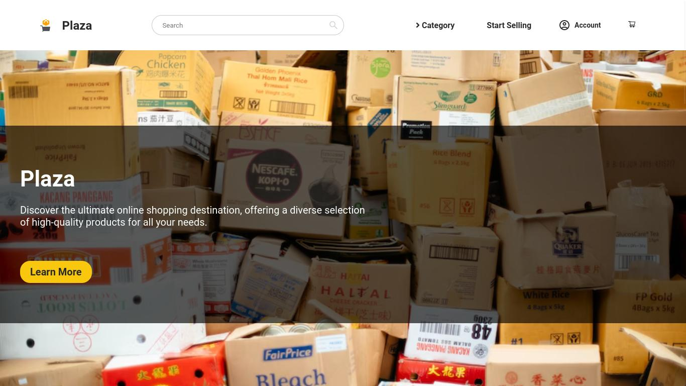
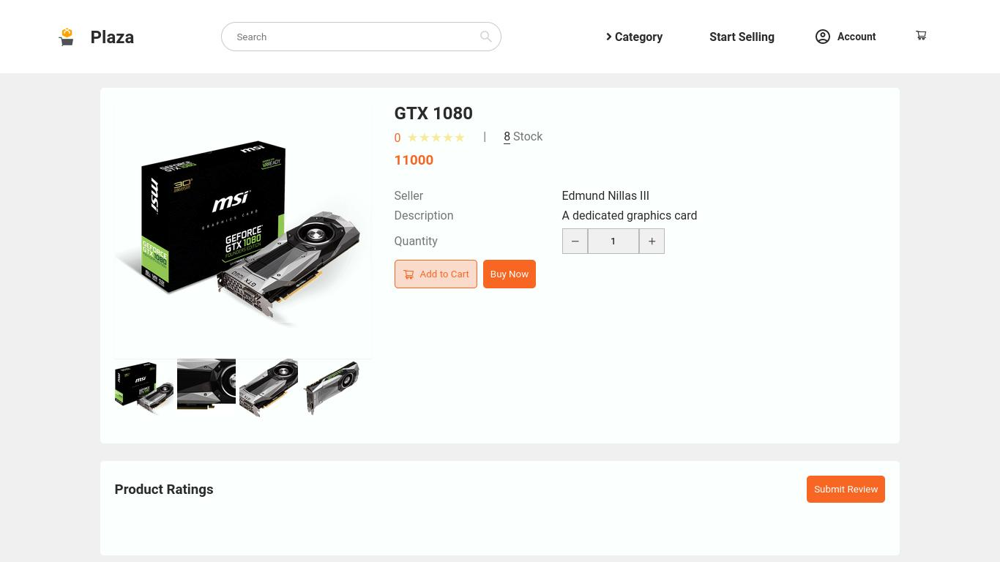

# Plaza
**[View Live Demo](https://plaza-g5bz.onrender.com)**

An an ecommerce website made with React, MongoDB, Firebase, and Redux. This was intended as a side project to expand my knowledge about developing large scale web applications.

# Frontend Dependencies
- React.js
- Redux
- SASS

# Backend Dependencies
- Node.js
- MongoDB
- Express
- Multer
- Firebase Admin
- Passport.js

# Features
- Buying/Selling/Review of products
- Search products and view their vendors
- Login/Sign Up User accounts
- Upload images related to the selling product
